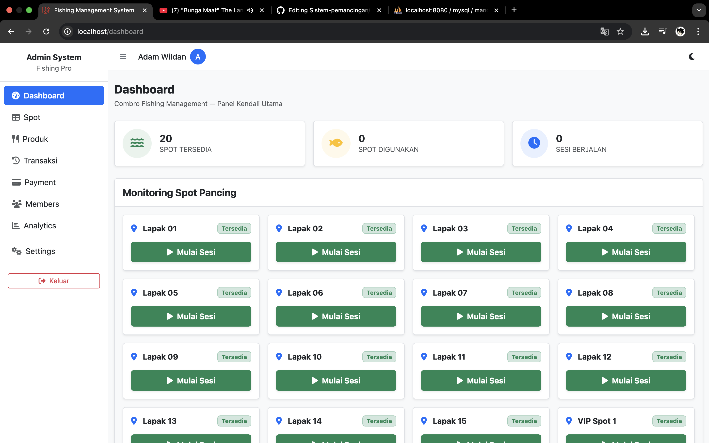
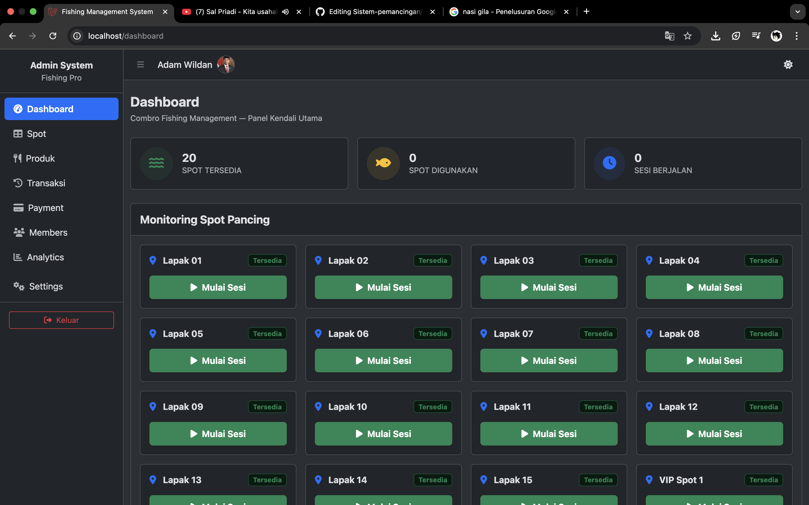
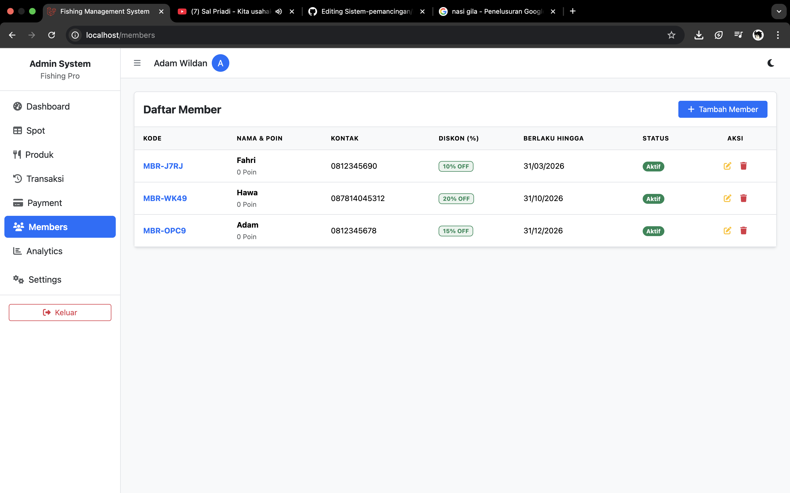
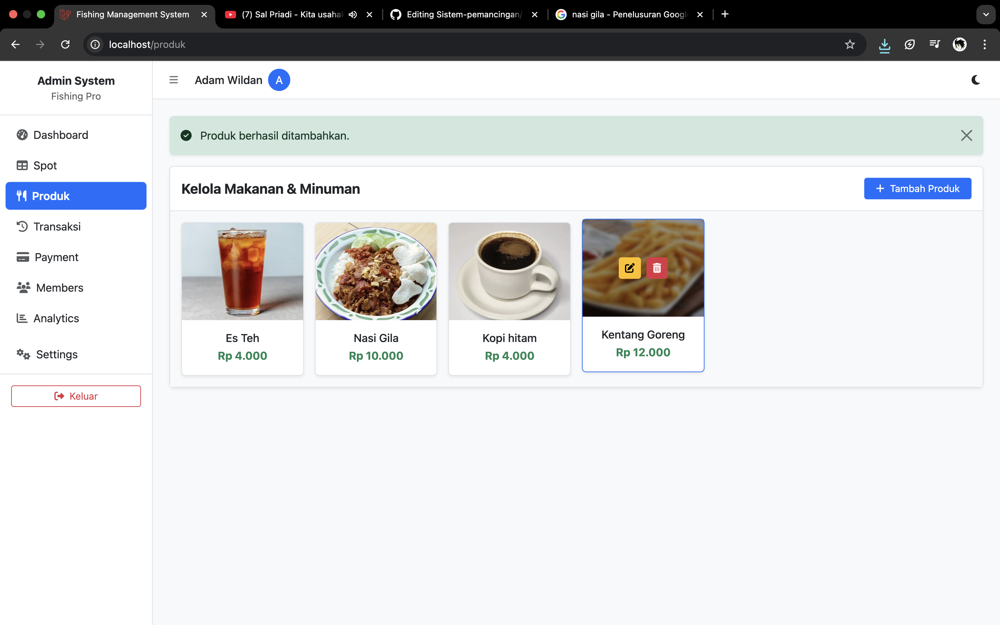
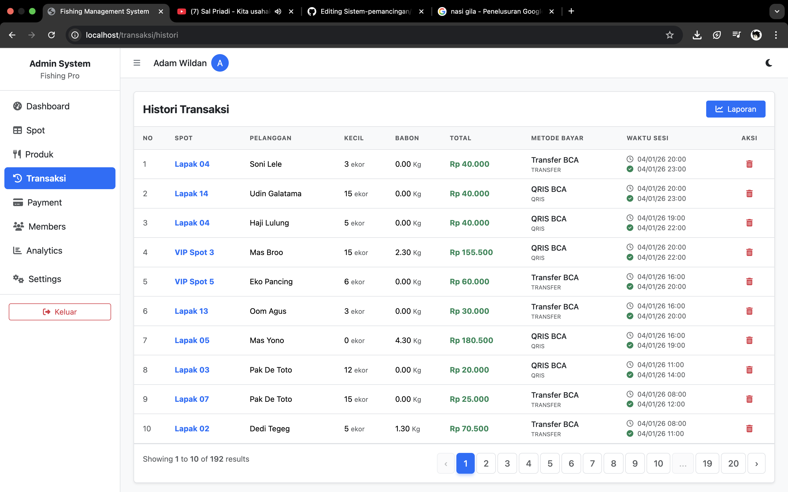
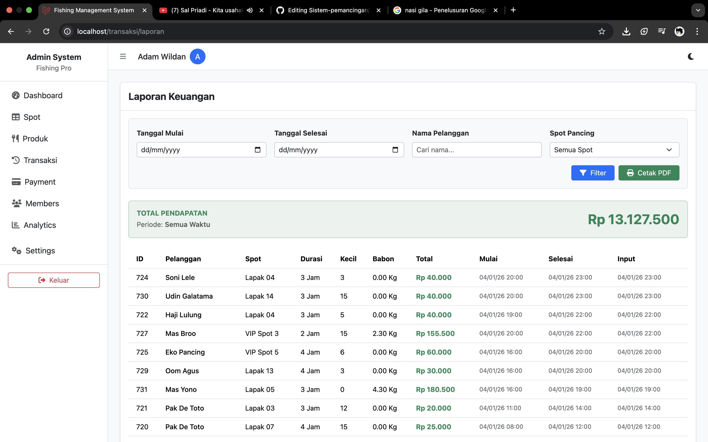
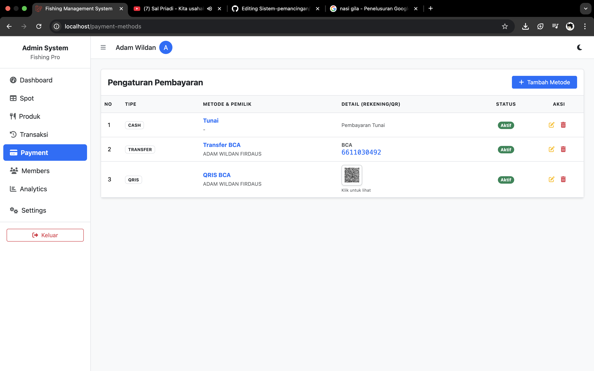
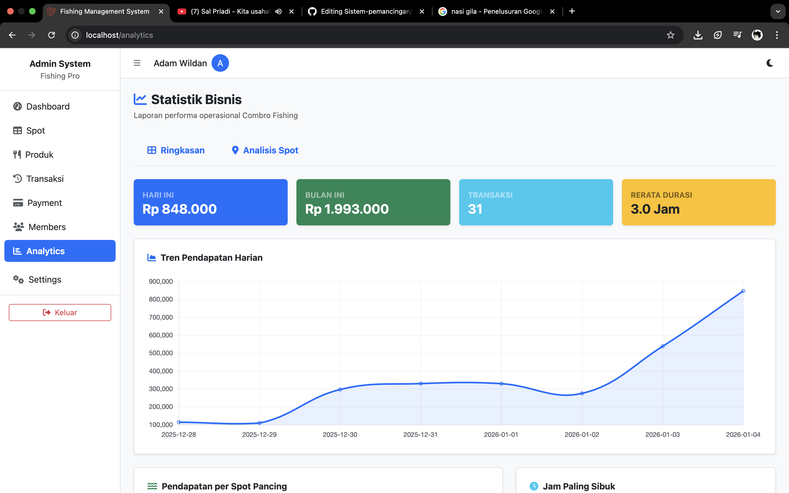

<p align="center">
  
</p>

<p align="center">
  
  
  
  
</p>

---

# 🎣 Combro Fishing Management System

**Combro Fishing Management System** adalah aplikasi manajemen operasional kolam pemancingan berbasis web yang dibangun menggunakan **Laravel 11**.  
Sistem ini dirancang untuk mendigitalisasi proses operasional harian secara terintegrasi, mulai dari pengelolaan lapak, member, transaksi sesi pancing, hingga laporan dan analisis bisnis.

---

## ✨ Fitur Utama

- **Dashboard Real-Time**  
  Panel kendali utama untuk memantau seluruh lapak secara langsung, membuka sesi, mencatat pesanan, dan memproses pembayaran.

- **Manajemen Spot (Lapak)**  
  Pengelolaan lapak pancing dengan tarif dinamis berdasarkan waktu (Pagi / Siang / Sore / Malam) yang otomatis tampil di Dashboard.

- **Mulai Sesi (Transaksi Baru)**  
  Form pendaftaran pelanggan yang diakses langsung dari lapak kosong di Dashboard dan terhubung dengan data member.

- **Selesai Sesi & Pembayaran**  
  Penutupan sesi pancing dengan perhitungan otomatis serta pilihan metode pembayaran yang telah dikonfigurasi.

- **Manajemen Member**  
  Pengelolaan pelanggan setia dengan sistem diskon dan poin otomatis saat transaksi.

- **Kelola Produk & Pesanan**  
  CRUD menu makanan dan minuman serta pencatatan pesanan tambahan selama sesi pancing.

- **Laporan Keuangan**  
  Rekap transaksi otomatis dengan fitur ekspor laporan ke PDF.

- **Analytics**  
  Visualisasi data transaksi berupa grafik tren pendapatan, jam sibuk, dan performa tiap lapak.

---

## 📸 Screenshots

<p align="center">
  
  
</p>

<p align="center">
  
  
</p>

<p align="center">
  
  
</p>

<p align="center">
  
  
</p>

---

## 🛠️ Tech Stack

| Komponen | Teknologi |
|--------|-----------|
| Framework | Laravel 11 |
| Frontend | Blade, Bootstrap 5, Alpine.js |
| Database | MySQL |
| Charts | Chart.js |
| PDF | Laravel DomPDF |
| Icons | Font Awesome |

---

## ⚙️ Installation

```bash
git clone https://github.com/aam228/Sistem-pemancingan.git
cd Sistem-pemancingan
composer install
npm install && npm run dev
cp .env.example .env
php artisan key:generate
php artisan migrate
php artisan storage:link
php artisan serve
```

## 📂 Project Structure

```bash
app/
 ├── Http/Controllers
 ├── Models
database/
 ├── migrations
 ├── seeders
resources/
 ├── views
routes/
 └── web.php
docs/
 └── screenshots

